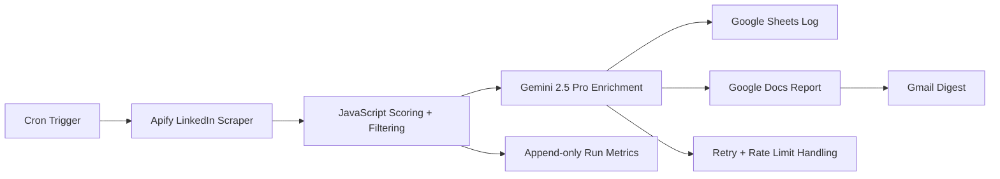

# AI-Agentic Daily Data Pipeline: n8n + Gemini + Google Workspace

A cron-driven data pipeline that scrapes, scores, enriches, logs, and summarizes job-market data using n8n, JavaScript, Gemini, Apify, and Google Workspace APIs.

This is a sanitized public version of a personal workflow. Real credentials, Google document IDs, email addresses, raw scraped data, and generated documents are not included.

## Why This Exists

The workflow was built to reduce repetitive internship-search work while keeping a review step before any application. It demonstrates orchestration, custom ranking logic, LLM enrichment, retry/rate-limit handling, Google Workspace integration, and daily email reporting.

## Architecture



## Tech Stack

- n8n for workflow orchestration
- JavaScript code nodes for filtering, scoring, parsing, and digest generation
- Apify for job-listing collection
- Gemini 2.5 Pro for draft resume adaptation
- Google Drive, Docs, Sheets, and Gmail APIs for document generation and reporting

## Repository Layout

```text
.
  job_application_workflow.json
  src/scoring.js
  tests/test_scoring.js
  examples/
  docs/
  .env.example
  AUDIT.md
```

## Setup

1. Import `job_application_workflow.json` into n8n.
2. Create n8n credentials for Google Drive, Docs, Sheets, and Gmail.
3. Set the environment variables shown in `.env.example`.
4. Replace any placeholder Google resource IDs with resources from your own Google account.
5. Run the workflow manually once before enabling the daily schedule.

## Configuration

Copy `.env.example` into your own local environment manager or n8n deployment settings. Do not commit a real `.env` file.

Required values:

- `APIFY_API_TOKEN`
- `GEMINI_API_KEY`
- `GOOGLE_RESUME_FILE_ID`
- `GOOGLE_SHEET_ID`
- `DIGEST_RECIPIENT_EMAIL`

## Run The Scoring Tests

```bash
npm test
```

The tests cover score calculation, missing fields, duplicate handling, malformed LLM response handling, and retry classification.

## Example Data

The files in `examples/` use fake companies, fake roles, and fake document links. They are meant to show data shape only.

## Safety Notes

- The workflow export does not include live n8n credentials.
- API keys are read from environment variables.
- Sample data is fake and does not contain scraped personal data.
- Generated resumes should be reviewed manually before use.
- Scraping workflows should be checked against the source site's terms and applicable policy before running.

## Limitations

- The workflow depends on third-party API availability and rate limits.
- Ranking is keyword-based and should be tuned with measured outcomes.
- LLM output is a draft, not an application-ready artifact.
- Public examples do not include real run metrics.

## Resume Claim Mapping

This repo supports the resume claim that the project used n8n, JavaScript scoring/filtering, Gemini enrichment, Google Workspace APIs, Gmail reporting, retry handling, and append-style logging. It intentionally excludes private credentials, real job data, and generated personal documents.

