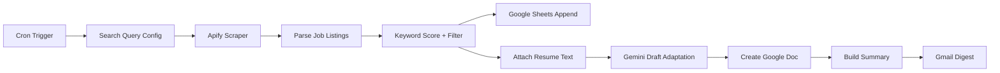

# Architecture

The workflow is a scheduled n8n pipeline with three main stages: collect, rank, and report.

## Flow

## Notes

- The scraper step collects listings for a fixed set of internship-focused search terms.
- The scoring step is intentionally simple and auditable.
- The LLM step drafts an adapted resume for review; it does not submit applications.
- Google Sheets is used as an append-style log for observability.

